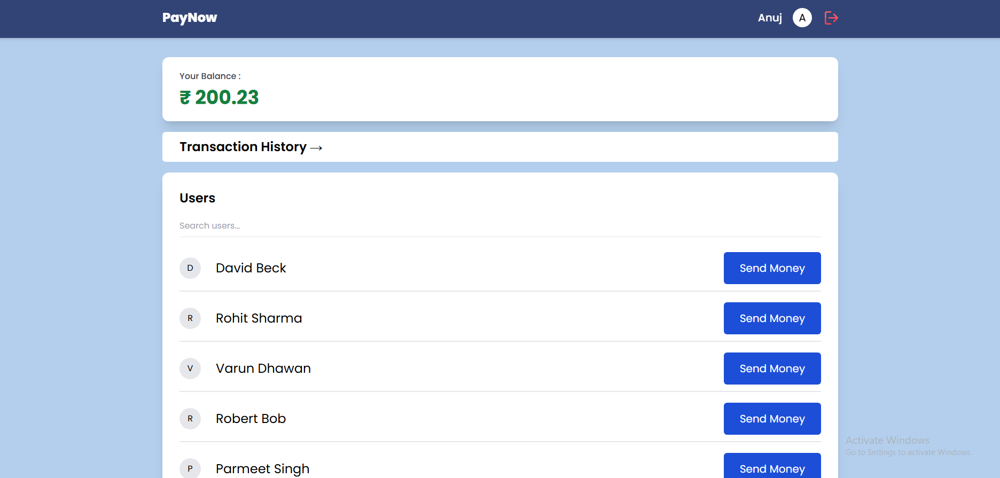

# Paynow 💰

  
  
  

**Paynow** is a secure full-stack financial transaction platform that lets users manage and simulate money transfers. It provides authentication, balance tracking, transaction history, and profile management with a smooth user experience.

---

### Dashboard

## Features ✨

- Secure **User Authentication** (Signup/Login)  
- **Balance Checks** in real-time  
- **Dummy Money Transfers** between users  
- **Transaction History** tracking  
- **Profile Management**  
- **Responsive UI** for mobile and desktop  

---

## Tech Stack 🛠️

- **Frontend:** React  
- **Backend:** Node.js  
- **Database:** MongoDB  
- **Authentication:** JWT / Custom auth  
